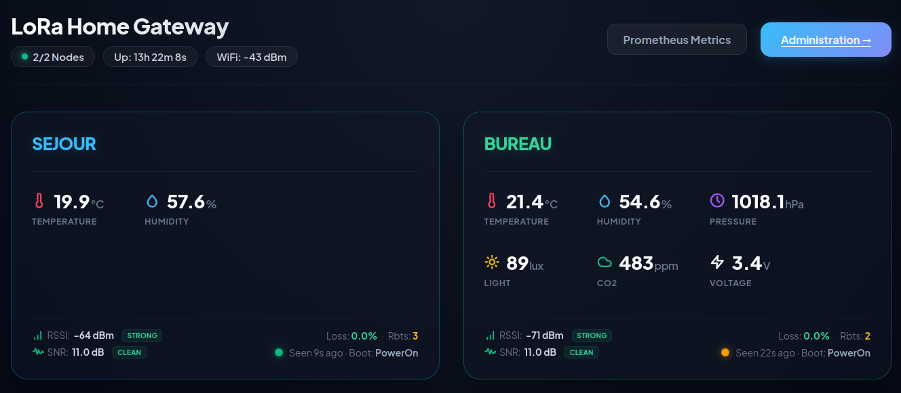

# LoRa Home Gateway & Sensor Nodes

An end-to-end telemetry system featuring a modular **ESP32-C6 Web Gateway** and configurable **ESP32-C3 Sensor Client Nodes** transmitting encrypted environmental data using **LoRa (433 MHz)** and **AES-128 GCM** security.

The gateway exports **Prometheus metrics** (`/metrics`) for Grafana visualization and hosts a responsive local diagnostic dashboard. Both devices store credentials dynamically inside **Non-Volatile Memory (NVM)** and support wireless **Web Bluetooth (BLE) provisioning** directly from modern web browsers.



---

## Compatible Hardware & Sensors

### Supported LoRa Transceivers
- **SX1262** (433 / 868 / 915 MHz with BUSY pin line)
- **SX1278 / SX1276** (433 / 868 MHz classic transceivers)

### Supported Sensors

| Sensor | Measurements | Physical Quantities & Units |
|---|---|---|
| **AHT20** | Temperature & Relative Humidity | °C, % RH |
| **BMP280** | Temperature & Barometric Pressure | °C, hPa |
| **TSL2561** | Ambient Light Intensity | Lux |
| **SCD41 / SCD40** | Photoacoustic CO₂ Concentration, Temp & Humidity | ppm, °C, % |

---

## Workspace Structure

- [**`lora-gw/`**](./lora-gw/): ESP32-C6 central gateway receiver, web server, and diagnostic dashboard.
- [**`lora-node/`**](./lora-node/): ESP32-C3 telemetry client node code with I2C auto-discovery.
- [**`shared_protocol.h`**](./shared_protocol.h): Central binary payload structure and sensor metadata definitions.

---

## Documentation

Comprehensive documentation is split into dedicated guides:

* [**System Architecture**](./doc/architecture.md): High-level system overview, component breakdowns, and communication pipelines.
* [**Compatible Sensors Guide**](./doc/sensors.md): Complete list of supported hardware sensors, I2C addresses, scaling rules, and guide to adding new sensors.
* [**Hardware Pinouts & Wiring**](./doc/hardware.md): Detailed pinout tables and wiring diagrams for ESP32-C6 Gateway and ESP32-C3 Node hardware.
* [**Configuration & Provisioning**](./doc/configuration.md): Web UI administration, BLE provisioning workflow, and wireless BLE OTA flashing.
* [**Protocol Specification**](./doc/protocol.md): Binary frame layout, `SensorPayload` structure, sensor type IDs, and scaling rules.
* [**Security Model**](./doc/security.md): AES-128 GCM encryption details, IV construction, replay protection, and BLE authentication.

---

## Quick Start (Build & Flash)

### 1. Install `arduino-cli` & Libraries
```bash
# Install arduino-cli globally
curl -fsSL https://raw.githubusercontent.com/arduino/arduino-cli/master/install.sh | BINDIR=~/.local/bin sh

# Install ESP32 platform core
arduino-cli core update-index
arduino-cli core install esp32:esp32

# Install required library dependencies
arduino-cli lib install "RadioLib" "Crypto" "Adafruit SSD1306" "Adafruit GFX Library" "Adafruit AHTX0" "Adafruit BusIO" "Adafruit Unified Sensor" "NimBLE-Arduino" "ArduinoJson" "NimBLE-DataPipe"
```

### 2. Compile & Flash the Gateway (`lora-gw`)
```bash
cd lora-gw
make         # Generates HTML headers and compiles ESP32-C6 firmware
make upload  # Flash via USB (Default port: /dev/ttyACM0)
```

### 3. Compile & Flash the Node (`lora-node`)
```bash
cd lora-node
make compile # Compiles ESP32-C3 node firmware
make upload  # Flash via USB (Default port: /dev/ttyACM0)
```
